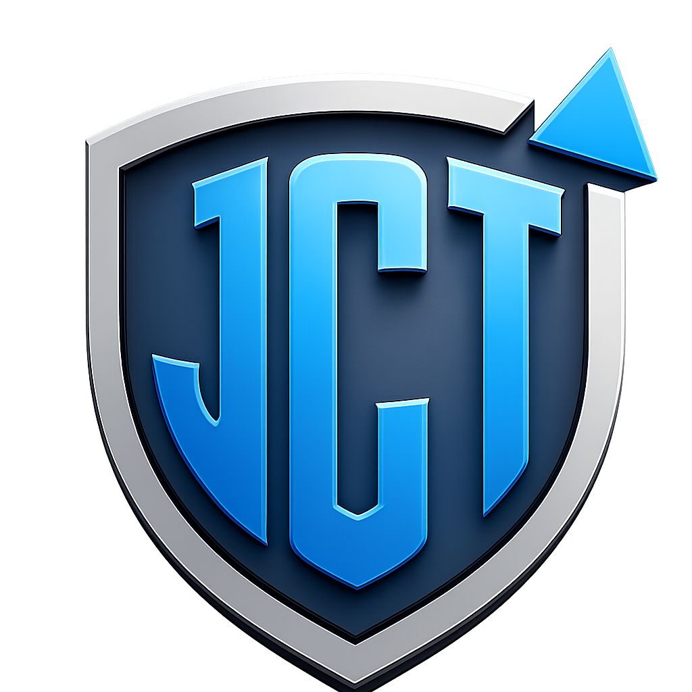

  
  <h1>Jutt Edits Studio</h1>
  
<strong>A powerful, closed-source video editing software developed by Jutt Cyber Tech.</strong>

  

---

### 🌟 Why We Built Jutt Edits Studio
We developed **Jutt Edits Studio** with one simple goal: to empower creators by providing them with a high-performance, professional-grade video editing tool that is completely free of charge. In a world full of expensive monthly subscriptions and software that constantly tracks your data, Jutt Cyber Tech wanted to innovate and build something different. We believe that everyone should have access to the tools they need to bring their creative visions to life—fully offline, fully private, and completely free. 

### 🔒 Closed Source Software
**Jutt Edits Studio** is the exclusive intellectual property of **Jutt Cyber Tech**. The core application source code is strictly proprietary and is securely protected; it is not available in this public repository.

### 📜 License Information
- **Free for Personal & Commercial Use**: You are free to download and use the application for any purpose.
- **Redistribution Prohibited**: The application is not salable, sub-licensable, or publishable anywhere else.
- **Privacy by Design**: This software operates 100% offline and collects exactly **zero** personal data. We are just trying to innovate!

### 📞 Contact Support
For business inquiries, urgent matters, or support (24/7):
- **Email**: Contact@juttcybertech.com
- **WhatsApp**: +923194817239
- **Socials (TikTok, GitHub, YouTube)**: @juttcybertech
